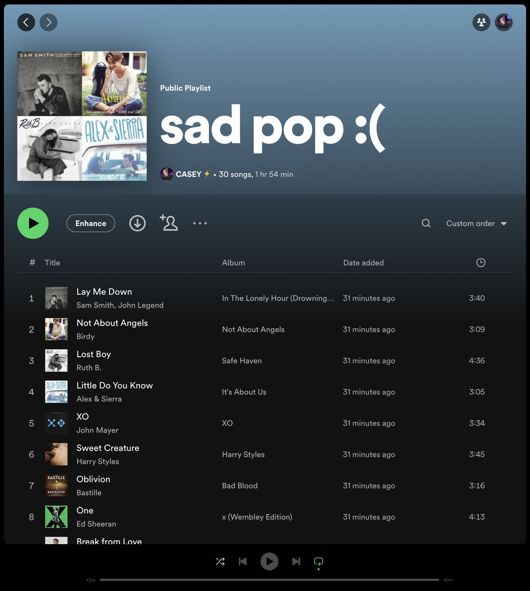

# hear-the-rainbow
Choose a color and enter a genre and we'll help you make a playlist that fits your color mood, that you can add straight to your Spotify account.

## Demo Video:

#### Watch the site in action here:
[](https://www.youtube.com/embed/kPKIjZCJiCc)

#### The playlist is automatically added to your Spotify account. This is what it looks like when you click "save" on the site:


## Getting Started

To run the app locally, follow these steps:

1. Clone the repository to your local machine.

2. Navigate to the project directory:

   ```
   cd hear-the-rainbow
   ```

3. Install the dependencies by running:

    ```
    npm install
    ```

4. Change the Spotify API client ID to the client ID for your app (made in the Spotify for Developers portal) and the redirect URIs to https://localhost:3000.

5. Start the development server by running:

    ```
    npm run start
    ```

    This command will transpile your code using Babel and bundle it with Webpack. Then, it will start the development server.

6. Open your web browser and visit http://localhost:3000 to access the app.

## Available Scripts

In the project directory, you can run the following scripts:

 - `npm run start`: Starts the development server and runs the app in development mode.
 - `npm run build`: Builds the app for production, generating an optimized bundle in the dist folder.
 - `npm test`: Launches the test runner in interactive watch mode.
 - `npm run eject`: Removes the single build dependency and copies configuration files into the project, allowing customization.

## Folder Structure

The project structure is organized as follows:

 - `src`: Contains the source code for the React application.
    - `index.js`: Entry point of the application.
    - `components`: Contains React components used in the app.
    - `index.css`: Styles specific to the application.
    - `registerServiceWorker.js`: Service worker for offline support.
    - `util`: Contains utility files used in the app.
        - `Spotify.js`: Provides utility functions for interacting with the Spotify API.
 - `public`: Contains the public assets and the HTML file.
    - `index.html`: The main HTML file that hosts the app.
